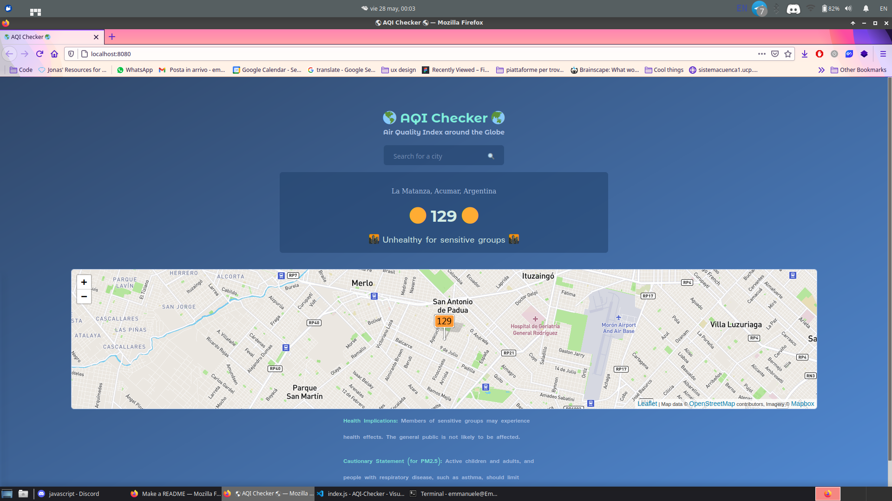
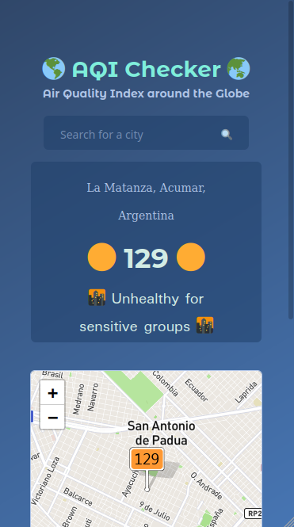

# 🌎 AQI Checker 🌏

## Description

This application is the final project for the Javascript advanced course by [Start2impact](www.start2impact.it) 

The goal of this project is to display the AQI (Air quality index) from around the world.

This project uses data from the [World Air Quality Index project](https://aqicn.org/contact/#/w/es), and uses [Leaflet](https://leafletjs.com/) to build the map


## Preview

#### Desktop view



#### Mobile view



## Environment Variables

For this project you will need a key from [Air Quality Open Data Platform](https://aqicn.org/data-platform/token/#/)

Once you get your key you can:
- Copy paste it in the file **.env.example** that you can find in the root of the project
- Rename said file in **.env**

Your **.env** file should look like something like this
```bash
AQI_KEY=4il2buob2o3iu42i34jn2p34iun2pi43b2
```

## Resources used

- [HTML](https://developer.mozilla.org/es/docs/Web/HTML), [CSS](https://developer.mozilla.org/es/docs/Web/CSS)
- [JavaScript](https://developer.mozilla.org/es/docs/Web/JavaScript)
- [Axios](https://github.com/axios/axios)
- [WebPack](https://webpack.js.org/)
- The lovely community of [Start2impact](www.start2impact.it)
- [Make a Readme](https://www.makeareadme.com/#)
- [matiassingers/awesome-readme](https://github.com/matiassingers/awesome-readme)
- [Leaflet](https://leafletjs.com/)
- [Air Quality Open Data Platform](https://aqicn.org/data-platform/token/#/)

## License
[MIT](https://choosealicense.com/licenses/mit/)

